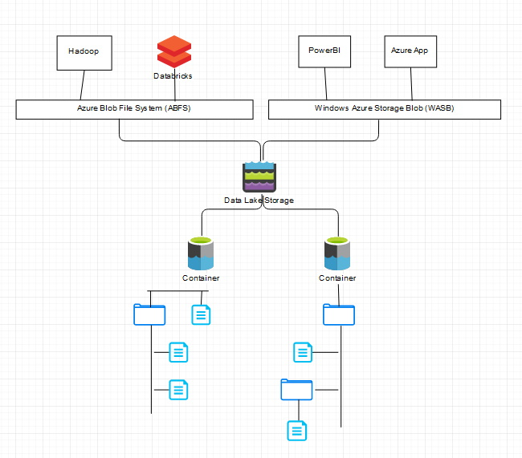

# Azure-DataLake
The idea is to connect to ADL storage (Azure Data Lake) from Databricks cluster and perform some Scala script on the ADL data. Let's imagine we have a Products.csv file in a ADL container. In this example, the Databricks connect to ADL storage using Azure AppId and mount ADL data (Products.csv). Make sure to register an App in Azure Active Directory (AD) and generate a password for the App (Certificates & Secrets). Also make sure to allow the App proper access to ADL storage using RBAC (Storage Blob Data Contributor).

Find the Scala script and fill in the necessary information. 
 
```
val appID = ""
val password = ""
val tenantID = ""
val containerName = "";
var storageAccountName = "";
``` 





## Blob storage vs ADL Gen2 Storage


|               | Blob Storage      | ADL Gen2 Storage |
| ------------- | ----------------- | ---------------- |
| Access tiers  | yes               |  yes             |
| Top level     | Container         | Container        |
| Lower level   | Virtual directory | Directory        |
| Container     | Blob              | File             |


|                    | Blob Storage      | ADL Gen2 Storage |
| ------------------ | ----------------- | ---------------- |
| Soft delete        | Yes               | No               |
| Snapshots          | Yes               | No               |
| Immutable storage  | Yes               | No               |
| Blobfuse           | Yes               | No               |


|                                 | Blob Storage      | ADL Gen2 Storage |
| ------------------------------- | ----------------- | ---------------- |
| Access keys                     | Yes               | Yes              |
| Shared Access Signature (SAS)   | Yes               | Yes              |
| RBAC                            | Yes               | Yes              |
| Access Control Lists (ACL)      | No                | Yes              |

